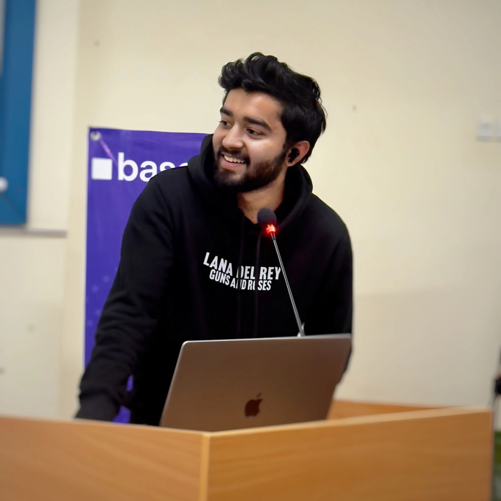
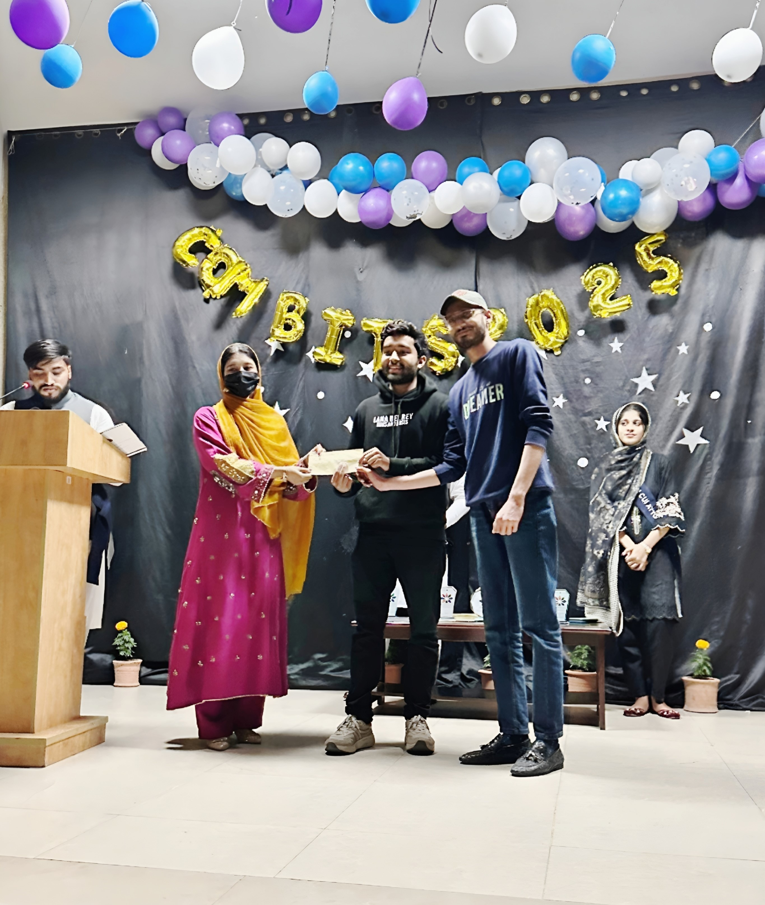
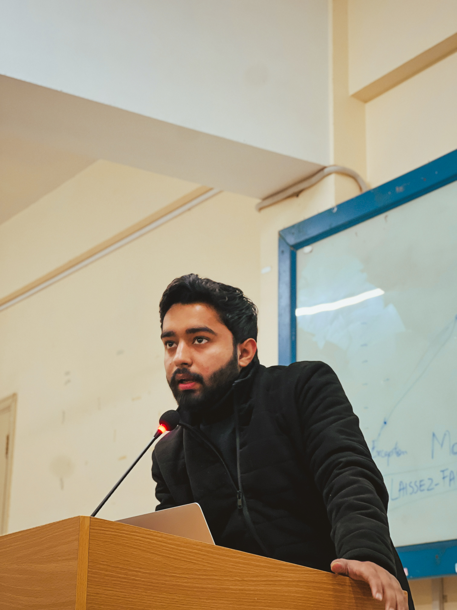
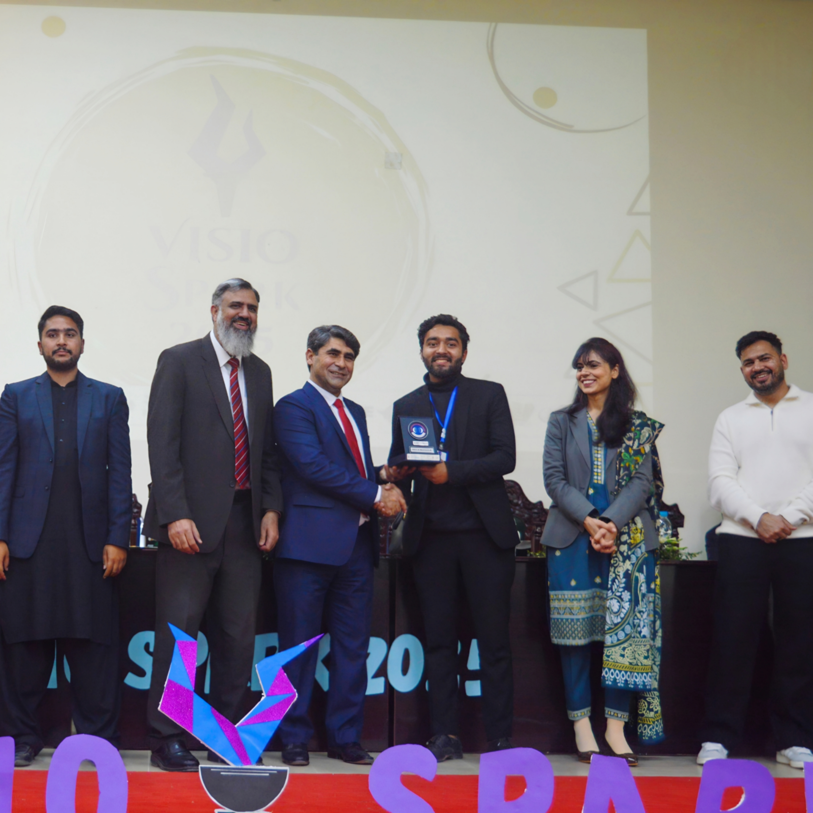
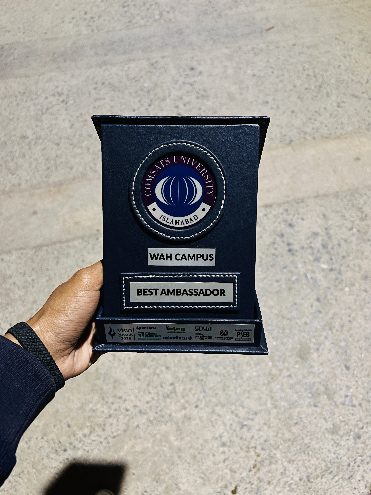
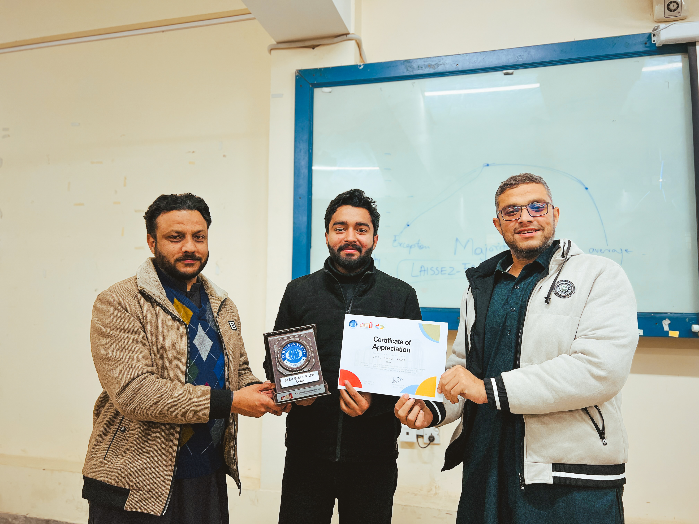
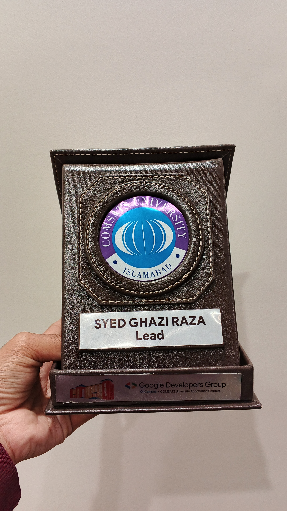
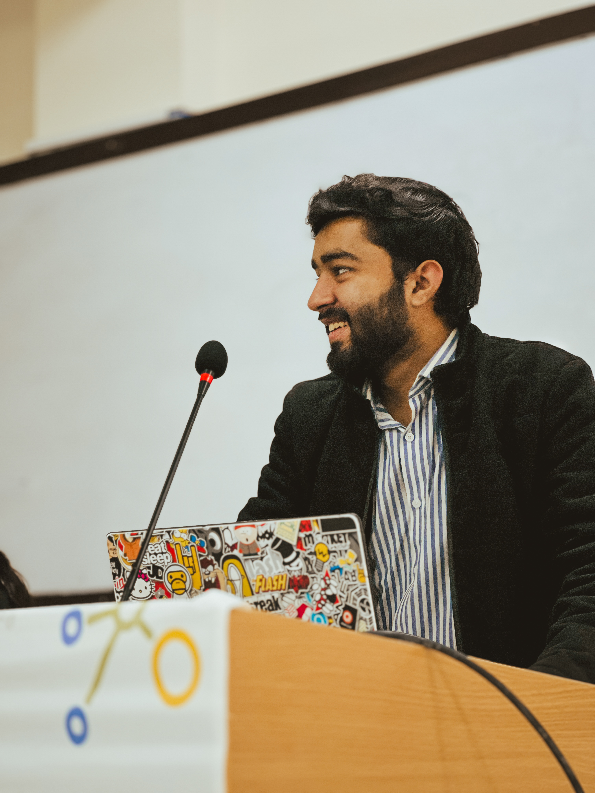

<h1 align="center">Hey, I'm Syed Ghazi Raza 👋</h1>

  <b>Full-Stack Software Engineer &nbsp;·&nbsp; GDGoC Campus Lead &nbsp;·&nbsp; Hackathon Winner</b>

 

## 🚀 About Me

- 🏛️ Built real-world public systems — including the **Abbottabad Police Website** & **eDevice-CR Platform**
- 🏆 **National Hackathon Winner** with proven end-to-end technical delivery
- 🌍 **Google Developer Groups on Campus Lead** — recognized with a **National Best Ambassador Award**
- 🤝 Passionate about shipping impactful products and growing engineering communities

---

## 🛠️ Tech Stack

**Frontend**

**Backend & APIs**

**Databases**

**AI / ML**

**DevOps & Tools**

---

## 🖼️ Highlights

<table>
  <tr>
    <td></td>
    <td></td>
    <td></td>
    <td></td>
    <td></td>
    <td></td>
    <td></td>
    <td></td>
  </tr>
</table>

---

## 📊 GitHub Stats

<table align="center">
  <tr>
    <td>
      
    </td>
    <td>
      
    </td>
  </tr>
</table>

---

## 🤝 Let's Connect

  
  &nbsp;
  
  &nbsp;
  
  &nbsp;
  

<i>Always open to interesting projects, collaborations, and conversations. Don't hesitate to reach out!</i>

